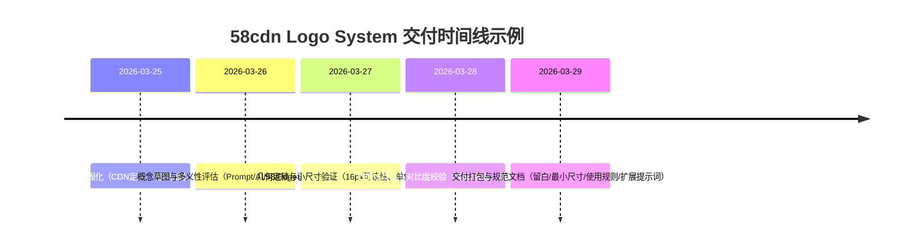

# 58cdn.com Logo 系统深度调研与原创 SVG 交付

## 执行摘要

本报告基于 CDN 的权威定义、公开色彩参考，提出一套面向 58cdn.com 的全新（不复刻、不描摹任何既有 Logo）的图形标识系统：以终端提示符 **`>_`** 为“开发者语境”核心，以“边缘节点网络”构图表达 **CDN 的分发与就近缓存**，并通过两枚竖向节点形成对“8”的隐喻，与左侧“终端块”共同构成“58”的弱提示；整体具备多义解读空间（终端、机器人、指针/仪表、航行/发射等），并优先保证 16px favicon 到 256px App 图标范围内的识别度。该语义锚点与 CDN 的“分布式服务器、就近缓存与快速交付网页资产”定义一致。

配色策略采用“强对比中性色 + 58 橙系强调色”的系统化组合：参考可见 `#FF371E`、`#FF4614`、`#FF6414` 等橙红区间 HTML 色值，其中 `#FF4614`位于红橙过渡的中段，适合作为技术子品牌“加速/交付”的强调色；同时用近黑 `#1C1C1E` 与近白 `#F0F0F3` 形成高对比底色，以适配暗色/浅色界面与单色印刷。

交付物包含：一套使用规范（色彩与对比、留白与最小尺寸、适用场景）、四个版本的**可直接使用 SVG**（标准版、标准纯色版、反色版、反色纯色版），以及一组可用于生成更多变体（例如“缓存/回源/刷新/安全”等功能图标延展）的生成式 AI 提示词模板。

## 研究依据与品牌语境

### CDN 的本质语义

从产品语义上，CDN 的核心不是“一个站点”，而是**分布式的边缘交付网络**：["company","Cloudflare","web performance company"]给出的通俗定义强调 CDN 是“地理分布式服务器组”，通过在靠近终端用户处缓存内容，来实现网页所需资产（HTML / JS / CSS / 图片 / 视频等）的快速传输。这一点决定了 Logo 更适合使用“节点/链路/分发”类符号，而非传统“媒体/门户”式图形。

在标准化语境中，["organization","Internet Engineering Task Force","internet standards body"]的 CDNI 工作组 charter 将 CDN 描述为运行在 L4–L7 的网络基础设施，用于高效分发与交付数字内容（含网页与图片、HTTP 流媒体等）。 这为“网络元素+交付链路”的图形抽象提供了严谨的语义依据：标识应该能让技术用户直觉联想到“边缘节点/链路/分发”。


### 58 品牌色彩的可借鉴部分

["organization","中国新闻网","china news service"]对 全新四色 Logo 的报道指出：橙、绿、蓝、红四个色块分别象征“用户至上、生态融合、创新基因、积极进取”等含义。 这为 58cdn 的色彩策略提供了方向：**强调色优先向“橙（用户/连接）”与“蓝（技术/创新）”靠拢**，但在本次交付里，为保证四版本一致性与单色可复刻性，将色彩收敛为“中性色+一个强调色”。

在公开的分享文章中，作者描述了品牌色焕新与使用规范。其展示图给出了橙红区间 HTML 色值：`#FF371E`、`#FF4614`、`#FF6414`。 本报告选用 `#FF4614` 作为 58cdn 的主强调色（更接近“加速/能量”的技术表达），并将另外两枚色值定位为可选的状态/交互补充色（用于 hover/告警等扩展场景，但不强制进入本次四个 SVG）。

## 标识方案与可解释性设计

### 图形母题与构图逻辑

本方案的图形标识（Logo Mark）由三组“可识别且可缩放”的形状构成：

- **终端块（Terminal Block）**：一个圆角矩形，代表控制台/终端窗口/工程模块。它将“58cdn 是基础设施能力”这件事显性化，与 CDN 在网络层面的基础设施属性一致。
- **提示符 `>_`（Prompt Motif）**：在终端块内部用简化几何呈现“`>` + `_` + 光标竖条”，把“开发者语境、脚本化交付、自动化运维”作为第一识别点。  
- **边缘节点（Edge Nodes）**：右侧两枚竖向圆点通过连接构成“节点对”，表达“边缘 PoP/节点、网络分发、就近交付”。这与 CDN “分布式服务器组，就近缓存与交付”的定义对齐。 

### “AI / A-I”暗示与“58”弱提示

本标识不直接书写文字，因此“AI”提示采用**结构暗示**而非字形描摹：  
- 终端内的“`>`”具备“A 的尖角/方向性”联想；  
- 节点连接与光标竖条具备“I 的竖向骨架”联想；  
- 组合起来可被解释为“AI 驱动的调度/优化/监控”，但不会把标识锁死在单一叙事上（避免未来产品范围扩展时被语义反噬）。

“58”的表达同样采取弱提示策略：右侧双圆点天然更接近“8”的视觉记忆；左侧终端块与 prompt 的组合则可被解释为“5（模块/入口）→ 8（分发网络）”的流程隐喻，即“从控制台发起配置/发布，交付到边缘网络”。这种“流程型 58”更贴近 CDN 产品的真实使用方式，而非强制把数字画出来。

### 多义解读空间

采用块体+节点的极简几何后，标识可被赋予多种“有利于传播”的解释：终端提示符、机器人头部（终端块像脸、节点像外部传感/天线）、仪表/指针（连接块像指针）、航行/发射（`>` 像出发/推进）、网络拓扑（节点+链路）等。其优势在于：不同受众会从各自经验出发“读出意义”，形成更强的二次传播潜力，同时保留一致的主识别（Prompt + Edge）。

## 色彩体系与可访问性

### 调色板与角色定义

主用色（本次四个 SVG 均严格限制在两到三色）：

- 深背景 / 深前景：`#1C1C1E`（近黑，适配暗色控制台与深色 UI）
- 浅背景 / 浅前景：`#F0F0F3`（近白，适配浅色页面与印刷底）
- 主强调色：`#FF4614`（参考展示图的 HTML 色值）
- 可选扩展（不进入本次四 SVG，但建议作为衍生交互/状态色）：`#FF371E`（更偏红）、`#FF6414`（更偏橙）  

### 对比度与无障碍建议

对比度计算遵循 ["book","Web Content Accessibility Guidelines 2.2","w3c recommendation 2024"]中对“对比度”与“相对亮度”的定义：对比度为 `(L1 + 0.05) / (L2 + 0.05)`（L1 为较亮色相对亮度，L2 为较暗色）。WCAG 同时指出：普通文本在 1.4.3 下通常以 4.5:1 作为阈值；非文本重要图形在 1.4.11 下通常以 3:1 作为阈值。

在本方案选色下（按上述公式计算）：

- `#F0F0F3` vs `#1C1C1E` 对比度约 **14.96:1**（极高，安全覆盖小尺寸与复杂背景的可见性）。  
- `#FF4614` vs `#1C1C1E` 对比度约 **4.97:1**（满足 4.5:1 阈值，适合在深底上作为小面积强调）。
- `#FF4614` vs `#F0F0F3` 对比度约 **3.01:1**（满足 3:1 非文本对比要求，适合在浅底上作为图形强调；若未来用作正文文本色，建议另行加深或改用深色正文）。

补充说明：WCAG 对“Logo/品牌名中的文字”在文本对比要求上存在豁免条款，但本方案仍主动以高对比结构设计来提升跨设备可见性。

## 使用规范与版本选择

### 版本对照表

| 版本 | 用途 | 背景色 | 前景色 | 备注 |
|---|---|---|---|---|
| 标准版 | 官网/控制台暗色主题、海报、启动页、品牌露出 | `#1C1C1E` | `#F0F0F3` | 强调色 `#FF4614` 用于“边缘节点+链路”，突出“加速/分发” |
| 标准纯色版 | 单色工艺、低成本印刷、极小尺寸列表图标 | `#1C1C1E` | `#F0F0F3` | 去掉强调色，保证单色可复刻与稳定渲染 |
| 反色版 | 浅色 UI、白底文档、PPT、Markdown、截图贴图 | `#F0F0F3` | `#1C1C1E` | 强调色保留，用于“结构聚焦”；在浅底上满足非文本 3:1 阈值 |
| 反色纯色版 | 浅底单色、表格/看板角标、印刷反白方案 | `#F0F0F3` | `#1C1C1E` | 全单色，适合任何不允许彩色的场景 |

色彩灵感来源的依据：58 相关公开材料中给出四色价值观阐释（橙/绿/蓝/红），并在品牌手册展示图中给出橙红区间的具体 HTML 色值。

### 留白与最小尺寸

为降低复杂背景与拥挤排版下的识别风险，建议用“节点直径”作为标准度量单位 **x**（本 SVG 中节点直径为 32，故 x=32/2=16 的半径也可作为简化度量）：

- **最小安全留白（Clear-space）**：标识外轮廓（圆形）四周至少保留 ≥ **1x（16px@256px 画板）** 的空白区，不放置其他图形或文字。  
- **最小尺寸（Minimum-size）**：  
  - favicon / UI 小图标：推荐 ≥ **16px**（仍可辨识“终端块+右侧双节点”的主结构）；若需在高噪声背景或低分辨率屏幕上使用，建议 ≥ **20–24px**。  
  - App 图标/启动页：建议使用 128–256px 版本以保证高密度屏幕的锐利度。  
- **单色复刻**：优先使用“标准纯色版/反色纯色版”；若需要“透明底单色”，可在不改变内部几何的前提下移除外部圆形底（本次交付的四 SVG 为“带底版本”，以保证四版本一致性）。

### 原创性与版权风险控制

本报告交付的图形为**原创几何构图**（圆角矩形、三角/折线提示符、节点圆形与连接件），只借鉴“终端 prompt / 网络节点”这类行业通用概念，不描摹、不复刻任何现有品牌标识，避免输出与既有 Logo 产生可识别的“近似复制”风险。域名归属与品牌色彩引用仅用于语境与配色灵感，不构成对任何既有图形的复制。

## SVG 交付与生成式扩展

### SVG 文件一：标准版

```svg
<svg xmlns="http://www.w3.org/2000/svg" viewBox="0 0 256 256" role="img" aria-label="58cdn logo 标准版">
  <circle cx="128" cy="128" r="124" fill="#1C1C1E"/>
  <rect x="40" y="80" width="136" height="96" rx="24" fill="#F0F0F3"/>
  <polygon points="70,112 96,128 70,144 62,136 80,128 62,120" fill="#1C1C1E"/>
  <rect x="110" y="144" width="44" height="12" rx="6" fill="#1C1C1E"/>
  <rect x="156" y="116" width="10" height="24" rx="5" fill="#1C1C1E"/>
  <rect x="176" y="120" width="16" height="16" rx="8" fill="#FF4614"/>
  <circle cx="208" cy="108" r="16" fill="#FF4614"/>
  <circle cx="208" cy="148" r="16" fill="#FF4614"/>
  <rect x="202" y="124" width="12" height="8" rx="4" fill="#FF4614"/>
</svg>
```

### SVG 文件二：标准纯色版

```svg
<svg xmlns="http://www.w3.org/2000/svg" viewBox="0 0 256 256" role="img" aria-label="58cdn logo 标准纯色版">
  <circle cx="128" cy="128" r="124" fill="#1C1C1E"/>
  <rect x="40" y="80" width="136" height="96" rx="24" fill="#F0F0F3"/>
  <polygon points="70,112 96,128 70,144 62,136 80,128 62,120" fill="#1C1C1E"/>
  <rect x="110" y="144" width="44" height="12" rx="6" fill="#1C1C1E"/>
  <rect x="156" y="116" width="10" height="24" rx="5" fill="#1C1C1E"/>
  <rect x="176" y="120" width="16" height="16" rx="8" fill="#F0F0F3"/>
  <circle cx="208" cy="108" r="16" fill="#F0F0F3"/>
  <circle cx="208" cy="148" r="16" fill="#F0F0F3"/>
  <rect x="202" y="124" width="12" height="8" rx="4" fill="#F0F0F3"/>
</svg>
```

### SVG 文件三：反色版

```svg
<svg xmlns="http://www.w3.org/2000/svg" viewBox="0 0 256 256" role="img" aria-label="58cdn logo 反色版">
  <circle cx="128" cy="128" r="124" fill="#F0F0F3"/>
  <rect x="40" y="80" width="136" height="96" rx="24" fill="#1C1C1E"/>
  <polygon points="70,112 96,128 70,144 62,136 80,128 62,120" fill="#F0F0F3"/>
  <rect x="110" y="144" width="44" height="12" rx="6" fill="#F0F0F3"/>
  <rect x="156" y="116" width="10" height="24" rx="5" fill="#F0F0F3"/>
  <rect x="176" y="120" width="16" height="16" rx="8" fill="#FF4614"/>
  <circle cx="208" cy="108" r="16" fill="#FF4614"/>
  <circle cx="208" cy="148" r="16" fill="#FF4614"/>
  <rect x="202" y="124" width="12" height="8" rx="4" fill="#FF4614"/>
</svg>
```

### SVG 文件四：反色纯色版

```svg
<svg xmlns="http://www.w3.org/2000/svg" viewBox="0 0 256 256" role="img" aria-label="58cdn logo 反色纯色版">
  <circle cx="128" cy="128" r="124" fill="#F0F0F3"/>
  <rect x="40" y="80" width="136" height="96" rx="24" fill="#1C1C1E"/>
  <polygon points="70,112 96,128 70,144 62,136 80,128 62,120" fill="#F0F0F3"/>
  <rect x="110" y="144" width="44" height="12" rx="6" fill="#F0F0F3"/>
  <rect x="156" y="116" width="10" height="24" rx="5" fill="#F0F0F3"/>
  <rect x="176" y="120" width="16" height="16" rx="8" fill="#1C1C1E"/>
  <circle cx="208" cy="108" r="16" fill="#1C1C1E"/>
  <circle cx="208" cy="148" r="16" fill="#1C1C1E"/>
  <rect x="202" y="124" width="12" height="8" rx="4" fill="#1C1C1E"/>
</svg>
```

### 生成式 AI 提示词模板

以下提示词用于生成“同一系统下的更多变体”（例如：缓存命中、回源、刷新/清除缓存、监控、告警、安全等），目标是保持“Prompt + Edge + 58 弱提示”的一致风格。

主提示词（生成更多图形方案）  
> 为 58cdn 设计一枚原创几何风格 Logo Mark：以终端提示符 `>_` 为核心母题，包含一个圆角终端块（像控制台窗口），右侧以两个边缘节点（圆点）和连接件表现 CDN edge network / 分发；整体可被弱解读为“58”（右侧两节点像 8，左侧终端块+提示符像 5 的流程入口）；扁平化、无渐变、无阴影、无真实材质；图形要在 16px favicon 与 256px app icon 下保持识别；输出 SVG 风格矢量图形。

配色与可访问性约束提示词  
> 仅使用三色：深色 `#1C1C1E`、浅色 `#F0F0F3`、强调色 `#FF4614`（可选扩展：`#FF371E`、`#FF6414`）；保证关键形状在浅底/深底都有足够对比；避免细线与小碎片；优先使用实心几何形状（圆、圆角矩形、三角形）；禁止使用现有品牌 Logo 元素或描摹任何已知标识。

负向提示词（避免风格跑偏与侵权风险）  
> 不要文字商标、不使用现成字体字形、不做 3D、不做玻璃拟态、不投影、不纹理、不照片、不复刻任何已存在 Logo、不使用复杂插画细节、不出现具体公司/平台的既有图形符号。

四版本一次性产出提示词（便于批量出图）  
> 同一几何构图输出四版：标准版（深底+浅前景+强调色）、标准纯色版（深底+浅前景、去强调）、反色版（浅底+深前景+强调色）、反色纯色版（浅底+深前景、去强调）；每版输出独立 SVG，必须包含 viewBox 0 0 256 256。

### 交付时间线示例



### 本地缩略图预览方法

将以下 HTML 保存为 `preview.html` 并用浏览器打开，可一次性看到四个 SVG 缩略预览（无需依赖外部资源）：

```html
<!doctype html>
<meta charset="utf-8">
<title>58cdn Logo Preview</title>
<body style="margin:24px;font-family:system-ui;display:flex;gap:24px;align-items:flex-start;flex-wrap:wrap;background:#fff;">
  <div><div style="margin-bottom:8px;">标准版</div><!-- paste 标准版 SVG here --></div>
  <div><div style="margin-bottom:8px;">标准纯色版</div><!-- paste 标准纯色版 SVG here --></div>
  <div><div style="margin-bottom:8px;">反色版</div><!-- paste 反色版 SVG here --></div>
  <div><div style="margin-bottom:8px;">反色纯色版</div><!-- paste 反色纯色版 SVG here --></div>
</body>
```